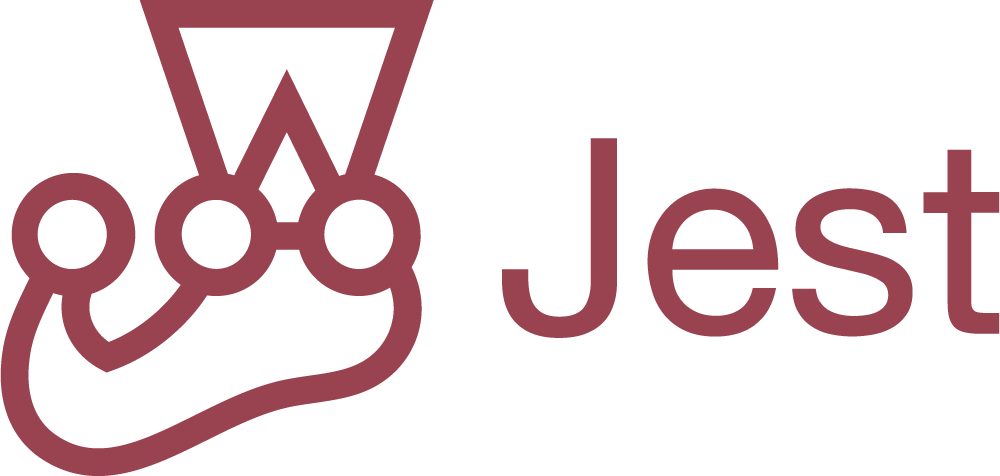

<h1 align="center">Hi 👋 My name is Tatsiana!</h1>

I’m a developer with over 10 years of experience in .NET, SQL, JavaScript, and five years of experience in AWS cloud. 
I have been involved in various projects, including CRM system, ERP project, Medical project, and some Business projects.

## 📫 Contact
- **LinkedIn**: [linkedin.com/in/tatsiana-v](https://linkedin.com/in/tatsiana-v)
- **GitHub**: [github.com/lionna](https://github.com/lionna)
- **CV**: [github.com/lionna](https://lionna.github.io/cv/)

🌍 Location: Poland, Warsaw

🏢 Current Employer: -

<h3 align="left">⚡ Some test projects :</h3>

- [x] [Test Project. HTML to PDF converter: React + .Net8 + few xUnit tests](https://github.com/lionna/converter_project)
- [x] [Test Project. Interactive Presentation Polls & Votes Backend: .Net 8 API + E2E tests  + few xUnit tests](https://github.com/lionna/api-presentation)
- [x] [Test Project. Rate-limiting: .Net 8 API + few xUnit tests](https://github.com/lionna/rate-limiter)
- [x] [Pet project: Api Auth (Node.js) for my pet project](https://github.com/lionna/api-auth)
- [x] [Angular Course project (Angular 18, NgRx, Signals, JEST, ESLint, Prettier)](https://github.com/lionna/test-angular-project)
- [x] [Angular final project (Angular 18, NgRx, Signals, JEST, i18n, Leaflet, PrimeNG, ESLint, Prettier, Husky)](https://github.com/lionna/express-train-app)
- [ ] [AWS Devops course](https://github.com/lionna/rsschool-devops-course-tasks) _(inprogress)_
- [ ] [React course](https://github.com/lionna/react-labs) _(inprogress)_

A bit of information about me

<h3 align="left">💼 Professional Experience :</h3>

- [GodelTechnologies](https://www.godeltech.com/) **March 2019 - September 2023** (4 years 7 months): UK project, microservices/api development, update/support
- [SolbegSoft](https://solbeg.com/) **February 2017 – February 2019** (2 years): US project, refactoring/updating a monolith
- [HiQoSolution](https://www.hiqo-solutions.com/) **August 2015 – January 2017** (1 year 6 months): US medicine project, HIPAA 
- [TopSoft](https://topsoft.by/) **November 2012 – February 2015** (2 years 4 months): RU/BLR project, salary calculation api development, update/support

<h3 align="left">🌱 EDUCATION AND COURSES :</h3>

- [x] **2007-2012** Belarusian National Technical University,  Minsk, Faculty of Information Technology and Robotics: Software for information systems and technologies (higher bachelor)
- [x] **Nov. 2010 – June 2012**: ITreeStudio Minsk, Training and Internship: Sencha Touch, HTML, CSS, JavaScript, JQuery, Sql 
- [x] **Febr. 2011 – August 2011**: GorInfaService, Subcontracting agreement: SQL, VBA
- [x] **2014**: ASP.NET MVC 4.0 (2013) 
- [x] [2023 Coursera: Meta Front-End Developer Professional Certificate](https://www.coursera.org/account/accomplishments/specialization/A26E3L7DR8BG)
- [x] [2023 Coursera: AWS Fundamentals](https://www.coursera.org/account/accomplishments/specialization/VJYZKSREYKH2)
- [x] [2023 Coursera: Developing Applications on AWS](https://www.coursera.org/account/accomplishments/specialization/AFXBNS88GLBW?utm_product=s12n)
- [x] [2024: AWS Cloud Developer Course](https://app.rs.school/certificate/zckpvd9n)
- [x] [2024: Angular Course](https://app.rs.school/certificate/c2cwzi8l)
- [ ] [2024: AWS DevOps Course](https://github.com/lionna/rsschool-devops-course-tasks)
- [ ] [2025: React Course](https://github.com/lionna/react-labs)
      

   
   
   

    
    

<h3  align="left">🛠 Technologies:</h3>

 

## 🗣️ Languages

- English: Upper Intermediate
- Russian: Native
- Belarussian: Native
- Ukrainian: Basic
- Polish: Basic

<h3 align="left">😄 Fun facts about me:</h3>

- I decided to become a programmer in 2004
- I've been using GitHub since 2012
- I have been working as a programmer a bit more than 10 years
- I love glaciers and nature, but I don't want to live in the mountains
- I won the genetic lottery and I look like a schoolgirl
- I don't drink alcohol and have any bad habits

